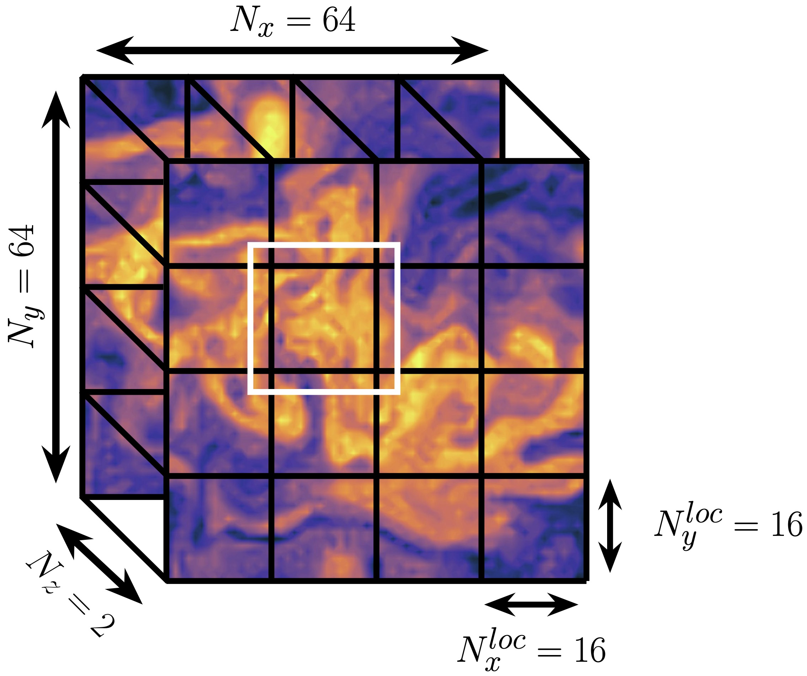

Methodology Overview
====================

This package implements Echo State Networks (ESNs), which were introduced by
:cite:t:`jaeger_echo_2001`.
ESNs are a Recurrent Neural Network architecture that are in a class of
techniques referred to as Reservoir Computing.
One defining characteristic of these techniques is that all internal weights are
determined by a handful of global or "macro-scale" scalar parameters, thereby avoiding
problems during backpropagation and reducing training time dramatically.

This page describes our two ESN implementations.
First is a "standard" ESN architecture that is useful for small
systems that can easily fit into memory on a computer.
Second is a distributed ESN architecture that can be used for larger scale
systems.

Standard ESN Architecture
#########################

The basic ESN architecture that is implemented by the :class:`xesn.ESN` class
is defined as follows: 

.. math::
   \mathbf{r}(n + 1) = (1 - \alpha) \mathbf{r}(n) +
    \alpha \tanh( \mathbf{W}\mathbf{r}(n) + \mathbf{W}_\text{in}\mathbf{u}(n) +
   \mathbf{b})

.. math::
   \hat{\mathbf{v}}(n + 1) = \mathbf{W}_\text{out} \mathbf{r}(n+1)

Here :math:`\mathbf{r}(n)\in\mathbb{R}^{N_r}` is the hidden, or reservoir, state,
:math:`u(n)\in\mathbb{R}^{N_\text{in}}` is the input system state, and
:math:`\hat{\mathbf{v}}(n)\in\mathbb{R}^{N_\text{out}}` is the estimated target or output system state, all at
timestep :math:`n`.
The sizes of each of these vectors is specified to :class:`xesn.ESN` via the
``n_reservoir``, ``n_input``, and ``n_output`` parameters, respectively.
This form of the ESN has a "leaky" reservoir,
where the ``leak_rate`` parameter :math:`\alpha`
determines how much of the previous hidden state to propagate forward in time.
This ESN implementation is *eager*, in the sense that all of the inputs, network
parameters, targets (during training), and predictions are held in memory.

Also, this form of the ESN assumes a linear readout, i.e., we do not transform
the hidden state nonlinearly or augment it with the input or output state
before passing it to the readout matrix.
This choice is made based on testing by :cite:t:`platt_systematic_2022`, who
showed that doing either of these two operations provided no additional
prediction skill over a simple linear readout.

Internal Weights
----------------

The adjacency matrix :math:`\mathbf{W}\in\mathbb{R}^{N_r \times N_r}`,
the input matrix :math:`\mathbf{W}_\text{in}\in\mathbb{R}^{N_r \times N_u}`,
and the bias vector :math:`\mathbf{b}\in\mathbb{R}^{N_r}`
are initialized with random elements, and usually re-scaled.
These three matrices are generated as follows:

.. math::
   \mathbf{W} = \dfrac{\rho}{f(\hat{\mathbf{W}})}
   \hat{\mathbf{W}}

.. math::

   \mathbf{W}_\text{in} = \dfrac{\sigma}{g(\hat{\mathbf{W}}_\text{in})}
   \hat{\mathbf{W}}_\text{in}

.. math:: 
   \mathbf{b} = \sigma_b\hat{\mathbf{b}}

where :math:`\rho`, :math:`\sigma`, and :math:`\sigma_b` are scaling factors,
:math:`f(\cdot)` and :math:`g(\cdot)` are normalization factors,
:math:`\hat{\mathbf{W}}` and :math:`\hat{\mathbf{W}}_\text{in}` are randomly generated matrices,
and
:math:`\hat{\mathbf{b}}` is a randomly generated vector.
Each of these components can be specified by the user via the 
``adjacency_kwargs``,
``input_kwargs``, and
``bias_kwargs``
options passed to :class:`xesn.ESN`.

As an example, it is common to use a very sparse adjacency matrix,
:math:`\hat{\mathbf{W}}`, with nonzero elements chosen from a uniform
distribution ranging from -1 to 1,
and to normalize the matrix by its spectral radius.
In many cases, the scaling factor is chosen to be close to 1.
These options could be selected by choosing:

.. code-block:: python

   adjacency_kwargs={
       "factor": 0.99,
       "distribution": "uniform",
       "normalization": "eig",
       "is_sparse": True,
       "connectedness": 10,
       }

As another example, in :cite:t:`smith_temporal_2023` the authors used a dense
input matrix with elements randomly chosen from a uniform distribution from -1
to 1, and normalized the matrix by its largest singular value.
This could be achieved as follows:

.. code-block:: python

   input_kwargs={
       "factor": 0.5,
       "distribution": "uniform",
       "normalization": "svd",
       }

with the ``factor=0.5`` just for the sake of an example, and note that
``is_sparse=False`` is the default if the option is not provided.

The options to the bias vector are even more simple, as there is no option for
sparsity and there are no normalization options. 

.. note::
   Internally, all of the options shown above are passed to the
   :class:`xesn.RandomMatrix` and :class:`xesn.SparseRandomMatrix` classes,
   where the ``is_sparse`` option selects between the two.
   Please see these two class descriptions for all available options, and
   numerous examples for creating different matrices.
   Also note that the number of rows and columns for each matrix and the length
   of the bias vector are automatically chosen based on the sizes set within
   the ESN.

Training
--------

The weights in the readout matrix :math:`\mathbf{W}_\text{out}` are learned
during training, :meth:`xesn.ESN.train`,
which aims to minimize the following loss function

.. math::
   \mathcal{J}(\mathbf{W}_\text{out}) =
    \dfrac{1}{2}\sum_{n=1}^{N_{\text{train}}} ||\mathbf{W}_\text{out}\mathbf{r}(n) -
    \mathbf{v}(n)||_2^2 
    +
    \dfrac{\beta}{2}||\mathbf{W}_\text{out}||_F^2

Here :math:`\mathbf{v}(n)` is the training data at timestep :math:`n`, 
:math:`||\mathbf{A}||_F = \sqrt{Tr(\mathbf{A}\mathbf{A}^T)}` is the Frobenius
norm, :math:`N_{\text{train}}` is the number of timesteps used for training,
and :math:`\beta` is a Tikhonov regularization parameter chosen to improve
numerical stability and prevent overfitting, specified via the
``tikhonov_parameter`` option to :class:`xesn.ESN`.

Due to the fact that the weights in the adjacency matrix, input matrix, and bias
vector are fixed, the readout matrix weights can be compactly written as the
solution to the linear ridge regression problem

.. math::
   \mathbf{W}_\text{out} = \mathbf{V}\mathbf{R}^T
    \left(\mathbf{R}\mathbf{R}^T + \beta\mathbf{I}\right)^{-1}

where we obtain the solution from `scipy.linalg.solve
<https://docs.scipy.org/doc/scipy/reference/generated/scipy.linalg.solve.html>`_ 
on CPUs
or `cupy.linalg.solve
<https://docs.cupy.dev/en/stable/reference/generated/cupy.linalg.solve.html>`_
on GPUs.
Here :math:`\mathbf{I}` is the identity matrix and
the hidden and target states are expressed in matrix form by concatenating
each time step "column-wise":
:math:`\mathbf{R} = (\mathbf{r}(1) \, \mathbf{r}(2) \, \cdots \, \mathbf{r}(N_{\text{train}}))`
and similarly
:math:`\mathbf{V} = (\mathbf{v}(1) \, \mathbf{v}(2) \, \cdots \, \mathbf{v}(N_{\text{train}}))`.

Distributed ESN Architecture
############################

It is common to use hidden states that are :math:`\mathcal{O}(10)` to :math:`\mathcal{O}(100)`
times larger than the target system dimension.
In applications that have high dimensional system states, it becomes
necessary to employ a parallelization strategy to distribute the target and
hidden states across many semi-independent networks.
:class:`xesn.LazyESN` accomplishes this with a generalization of the algorithm introduced by
:cite:t:`pathak_model-free_2018`, where we use
`dask <https://www.dask.org/>`_ to parallelize the
computations.

The :class:`xesn.LazyESN` architecture inherits most of its functionality from
:class:`xesn.ESN`.
The key difference between the two is how they interact with the underlying data
they're working with.
While the standard ESN had a single network that is eagerly operated on in
memory, :class:`xesn.LazyESN` distributes
multiple networks to different subdomains of a single dataset and invokes *lazy*
operations via the `dask.Array` API.
This process is described with an example below.

Example: SQG Turbulence Dataset
-------------------------------

We describe the parallelization strategy based on the dataset used by
:cite:t:`smith_temporal_2023`, which was generated by
`this model, written by Jeff Whitaker <https://github.com/jswhit/sqgturb>`_,
for Surface Quasi-Geostrophic turbulence.
For the purposes of this discussion, all that matters is the size of the
dataset, which is illustrated below, and more details can be found in Section 2
of :cite:t:`smith_temporal_2023`.

The dataset has 3 spatial dimensions :math:`(x, y, z)`, and evolves in time, so
that the shape is :math:`(N_x = 64, N_y = 64, N_z = 2, N_{time})`.
We first subdivide the domain into smaller chunks along the :math:`x` and :math:`y`
dimensions, akin to domain decomposition techniques in General Circulation
Models.
The subdivisions are defined by specifying a chunk size
to the model via ``esn_chunks``.
In the case of our example, the chunk size is 

.. code-block:: python

   esn_chunks={"x": 16, "y": 16, "z": 2}

and these chunks are denoted by the black lines across the domain in the figure
above.
Under the hood, :class:`xesn.LazyESN` assigns a local network to each chunk,
where each chunk becomes a separate dask task.
Note that unlike :class:`xesn.ESN`, :class:`xesn.LazyESN` does not have
``n_input`` and ``n_output`` parameters, but these are instead inferred from the
multi-dimensional chunksize, given by ``esn_chunks``.

Communication between chunks is enabled by defining an overlap region,
harnessing dask's flexible `overlap
<https://docs.dask.org/en/latest/generated/dask.array.overlap.overlap.html>`_
function (see `this explanation in the dask documentation
<https://docs.dask.org/en/latest/array-overlap.html#explanation>`_ for
additional description of this function).
The overlap is defined by specifying the size of the overlap in each direction.
For example

.. code-block:: python

   overlap={"x": 1, "y": 1, "z": 0}

defines a single grid cell overlap in :math:`x` and :math:`y`, but no overlap in
the vertical.
Note that this argument is very similar to what can be provided to dask, except
that the dimensions are labelled here, rather than numeral indices,
due to our reliance on xarray.
As an example, the overlap region is indicated by the white box in the figure
above, where this overlap extends to both vertical levels for the chunk.

.. note::
   Because of how :class:`xesn.LazyESN` relies on dask chunks to define the
   bounds of each distributed region, the time dimension is not allowed to be
   chunked, nor can it have an overlap. That is, the size passed to
   ``esn_chunks`` must be the size of the time dimension, or ``{"time":-1}``
   (shorthand).
   The only option allowed for ``overlap`` is ``{"time":0}``.
   These are the defaults if nothing is provided for time as they are the only
   acceptable options.

We have to tell the :class:`xesn.LazyESN` how to handle overlaps on the
boundaries.
See `here <https://docs.dask.org/en/latest/array-overlap.html#boundaries>`_ for
available options, since this is passed directly to dask's overlap function.
In the case above, the domain is periodic in :math:`x` and :math:`y`, so we can
simply write

.. code-block:: python

   boundary="periodic"
   # or equally
   boundary={"x": "periodic", "y": "periodic"}

Note once again that if a ``dict`` is used like the second case, then as with
``overlap``, the difference between what is expected here and with dask is that
the dimensions should be labelled, rather than provided as numeral indices.

One final option to :class:`xesn.LazyESN` is ``persist``. When dask arrays are
told to ``.persist()`` it means that they are brought into memory, using the
memory of the resources available (this means all data are brought into memory
if on a local machine).
In :class:`xesn.LazyESN`, the ``persist`` option is a boolean, where if
``True``, then ``.persist()`` is called in the following places:

- in :class:`xesn.LazyESN.train` and :class:`xesn.LazyESN.predict`
  on the input data, after calling dask's overlap function
- in :class:`xesn.LazyESN.train` on the resulting readout matrix,
  :attr:`xesn.LazyESN.Wout`, after all computations
- in :class:`xesn.LazyESN.predict` on the resulting prediction, after all
  computations

See `this StackOverflow post
<https://stackoverflow.com/questions/41806850/dask-difference-between-client-persist-and-client-compute>`_
for some discussion about persisting data, and see
`this page in the dask documentation
<https://distributed.dask.org/en/latest/manage-computation.html#dask-collections-to-futures>`_
for more information.

More Generally
--------------

Here we make some notes for extending the description beyond this example.
The dimensions that are chosen to be chunked (here :math:`x` and :math:`y`)
should be first in the dimension order, and time needs to be last.
Additionally, the time dimension needs to be labelled "time", whereas the names
of all other dimensions do not matter.
Finally, currently only two dimensions are regularly tested, but the
capability to add more could be added in the future.

Mathematical Definition
-----------------------

The parallelization is achieved by subdividing the domain into :math:`N_g` chunks, and
assigning individual ESNs to each chunk.
That is, we generate the sets
:math:`\{\mathbf{u}_k \subset \mathbf{u} | k = \{1, 2, ..., N_g\}\}`, and
where each local input vector :math:`\mathbf{u}_k` includes the overlap region
discussed above. 
The distributed ESN equations are

.. math::
   \mathbf{r}_k(n + 1) = (1 - \alpha) \mathbf{r}_k(n) +
    \alpha \tanh( \mathbf{W}\mathbf{r}_k(n) + \mathbf{W}_\text{in}\mathbf{u}_k(n) +
   \mathbf{b})

.. math::
   \hat{\mathbf{v}}_k(n + 1) = \mathbf{W}_\text{out}^k \mathbf{r}_k(n+1)

Here :math:`\mathbf{r}_k, \, \mathbf{u}_k \, \mathbf{W}_\text{out}^k, \, \hat{\mathbf{v}}_k`
are the hidden state, input state, readout matrix, and estimated output state
associated with the :math:`k^{th}` data chunk.
The local output state :math:`\hat{\mathbf{v}}_k` does not include the
overlap region.
Note that the various macro-scale paramaters
:math:`\{\alpha, \rho, \sigma, \sigma_b, \beta\}` are fixed for all chunks.
Therefore the only components that drive unique hidden states on each chunk are
the different input states :math:`\mathbf{u}_k` and the readout matrices
:math:`\mathbf{W}_\text{out}^k`.

Macro-Scale Parameters
######################

From our experience, the most important macro-scale parameters that must be
specified by the user are the

- input matrix scaling, :math:`\sigma`, ``input_kwargs["factor"]``
- adjacency matrix scaling, :math:`\rho`, ``adjacency_kwargs["factor"]``
- bias vector scaling, :math:`\sigma_b`, ``bias_kwargs["factor"]``
- Tikhonov parameter, :math:`\beta`, ``tikhonov_parameter``
- leak rate, :math:`\alpha`, ``leak_rate``

See `this example <example_macro_training.ipynb>`_ for a demonstration of using the
`surrogate modeling toolbox <https://smt.readthedocs.io/en/latest/index.html>`_
to perform Bayesian optimization and find well performing parameter values.
