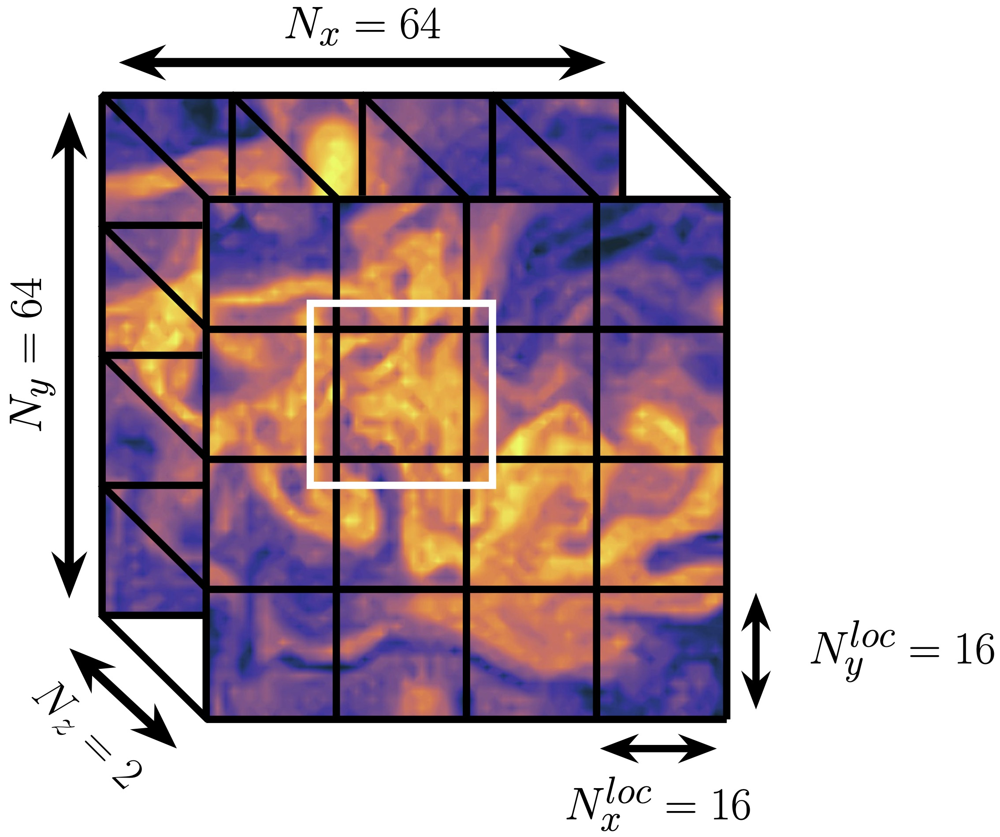

# Summary

Xesn is a python package that
* allows scientists to easily develop Echo State Networks (ESNs) for a variety of
  forecasting problems
* ESNs are a particular form of RNN originally introduced by ...
  which have been shown to be performant in forecasting chaotic dynamics,
  and are therefore a powerful network choice for a variety of problems
* however, due to the relative simplicity of the ESN architecture, many
  scientists implement the network from scratch
* xesn provides a straightforward and standard implementation of ESNs, which can
  flexibly handle multi dimensional forecasting tasks
* xesn aims to strike the balance between simplicity and flexibility, so
  that users have the tools options necessary to design powerful networks in a
  standardized, trimmed down, performant framework.
* the package does this by providing design options
  based on network design aspects that were shown to be most impactful by
  [@platt_systematic_2022]
* xesn was initially developed to tackle the problem of forecasting weather
  dynamics, and so it integrates with Python packages familiar to weather and
  climate scientists
* however, the package is ultimately general, and could be utilized in other
  domains where ESNs have been useful such as ... economics, signal processing,
  and biomedical applications.

# Statement of need

1. ESNs are simple, but self implementation leaves
    * lots of room for unnecessary experimentation
    * lots of room for code efficiency

   Addressed with
    * relatively standardized approach, (for example don't do the different
      readout options) which streamlines the code and interacts
      with NumPy/SciPy or CuPy for compute and memory efficiency
    * xarray allows for efficient I/O with zarr
    * parameter optimization, to automate the architecture tuning process

2. Multi dimensional applications:
    * most ESN implementations make forecasts of 1D state vectors, but many
      forecasting applications, such as weather, are multi dimensional
    * multi dimensional architecture used in Arcomano et al in Fortran, and is
      more designed for hybrid physics-ML applications
    * we provide this in Python in an easy to use interface
    * In multi dimensional applications, the size of the reservoir will usually
      need to increase in order to

   Addressed with:
    * leans on xarray, which handles multidimensional data easily via
      named axes
    * uses dask to parallelize multiple reservoirs in whatever parallel
      computing environment is available (e.g., multiple threads on a single
      laptop or multiple processes across many nodes in the cloud or in a
      traditional HPC environment)

# Background

Where to put this stuff?

* Arcomano: ESNs in multidimensional weather forecasting
* Penny: ESN in DA
* Platt: ESNs constrained by LE do really well
* [@smith_temporal_2023]: ESNs constrained by KE Spectrum (or PSD) preserve
  small scale features in turbulent GFD

# The Architectures Implemented

## Standard ESN Architecture

The basic ESN architecture that is implemented by the `xesn.ESN` class
is defined as follows:

\begin{equation}
    \mathbf{r}(n + 1) = (1 - \alpha) \mathbf{r}(n) +
    \alpha \tanh( \mathbf{W}\mathbf{r} + \mathbf{W}_\text{in}\mathbf{u}(n) +
   \mathbf{b})
\end{equation}
**TODO** Align these two eqns
\begin{equation}
   \hat{\mathbf{v}}(n + 1) = \mathbf{W}_\text{out} \mathbf{r}(n+1)
\end{equation}

Here $\mathbf{r}(n)\in\mathbb{R}^{N_r}$ is the hidden, or reservoir, state,
$u(n)\in\mathbb{R}^{N_\text{in}}$ is the input system state, and
$\hat{\mathbf{v}}(n)\in\mathbb{R}^{N_\text{out}}$ is the estimated target or output system state, all at
timestep $n$.

* linear readout becasue Platt et al

## Training

* simple, use linsolve from scipy, shown to be fastest

## Parallel ESN Architecture

...

## Parameter optimization

* Use smt
* can constrain MSE and PSD as in Smith et al
* can't be on GPUs

# Potential Scaling Results

# Citations

Citations to entries in paper.bib should be in
[rMarkdown](http://rmarkdown.rstudio.com/authoring_bibliographies_and_citations.html)
format.

If you want to cite a software repository URL (e.g. something on GitHub without a preferred
citation) then you can do it with the example BibTeX entry below for @fidgit.

For a quick reference, the following citation commands can be used:
- `@author:2001`  ->  "Author et al. (2001)"
- `[@author:2001]` -> "(Author et al., 2001)"
- `[@author1:2001; @author2:2001]` -> "(Author1 et al., 2001; Author2 et al., 2002)"

# Figures

Figures can be included like this:

and referenced from text using \autoref{fig:example}.

Figure sizes can be customized by adding an optional second parameter:
{ width=20% }

# Acknowledgements

We acknowledge contributions from Brigitta Sipocz, Syrtis Major, and Semyeong
Oh, and support from Kathryn Johnston during the genesis of this project.

# References
